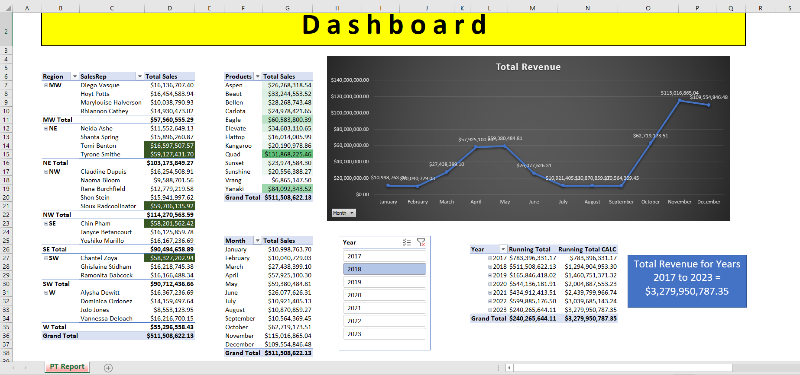

# 📊 Sales Dashboard - Excel Project

This Excel project contains a comprehensive **Sales Dashboard** designed to track the total sales, revenue trends, and running totals across multiple regions and products from 2017 to 2023. The dashboard is fully interactive, providing detailed insights by region, salesperson, product, and monthly sales.

---

## 📁 Project Overview

The dashboard visualizes key sales data and provides analysis through the following key sections:

1. **Sales Data by Region and Sales Rep**
2. **Product Sales Overview**
3. **Monthly Revenue Trends**
4. **Running Total by Year**
5. **Grand Totals for Sales and Revenue**

---

## 🔑 Key Features

### 1. **Sales Data by Region and Sales Rep**
The data is divided into regions (MW, NE, NW, SE, SW, and W) with total sales displayed for each salesperson:

- **Regions**: MW (Midwest), NE (Northeast), NW (Northwest), SE (Southeast), SW (Southwest), and W (West)
- **Sales Reps**: Each region includes the sales reps and their individual total sales (e.g., Diego Vasque, Neida Ashe, Chin Pham, etc.).

### 2. **Product Sales Overview**
Each product's total sales are displayed, including:
- **Top Products**: Quad, Kangaroo, Yanaki, and others.
- **Grand Total Sales**: $511,508,622.13 (for the entire dataset)

The dashboard also allows for filtering by product to quickly analyze individual product performance.

### 3. **Monthly Revenue Trends**
A **line chart** shows the total revenue by month from January to December for each year, including a detailed breakdown for each month and year:

- **Example**: January total revenue of $10,998,763.70, March revenue of $27,438,399.10, and December revenue of $109,554,846.48.
- Visual representation of revenue fluctuations across different months and years.

### 4. **Running Total by Year**
The **Running Total** is calculated for each year (2017 to 2023) based on the monthly revenue. It provides an ongoing total that helps track performance over time:

- **Running Total by Year**: For example, in 2023, the running total is $3,279,950,787.35.
  
You can also view running totals in different columns, such as "Running Total CALC" for further analysis.

### 5. **Grand Totals**
- The **Grand Total Revenue** across all years (2017–2023) is displayed: **$3,279,950,787.35**.
- The **Grand Total Sales** is $511,508,622.13.

### 6. **Interactive Filters**
The dashboard allows users to filter by **Year** and **Month** for a more tailored view:
- **Year Filter**: Select any year between 2017 and 2023.
- **Month Filter**: Select specific months to view total sales for that period.

---

## 📊 Visualizations

1. **Total Revenue Line Chart**:  
   A line graph showing total revenue by month across different years, highlighting trends and peaks in revenue.

   

2. **Sales and Product Overview**:  
   Displays total sales by region, product, and salesperson.

---

## 🧑‍💻 Technologies Used

- **Microsoft Excel** for creating and managing the sales dashboard.
- **Excel Formulas** and **PivotTables** for data processing.
- **Charts and Visualizations** for revenue trends and product sales.
- **Data Filtering** using Excel's built-in filter and slicer functionalities.

---

## 🚀 Use Cases

- **Sales Monitoring**: Track sales performance by region, product, and salesperson.
- **Revenue Forecasting**: Use monthly revenue trends to predict future sales.
- **Product Performance**: Analyze which products are generating the most revenue.
- **Yearly Analysis**: Use the running total to evaluate annual sales growth or decline.

---

## 🧠 Future Enhancements

- Integrate with real-time data sources (e.g., connecting Excel with a CRM system for up-to-date sales data).
- Add more advanced forecasting capabilities using Excel’s **Data Analysis Toolpak** or external add-ins.
- Create drill-through functionality for deeper analysis by specific regions or sales reps.

---

## 📷 Screenshot of Dashboard

> *Ensure the images are correctly linked in your repo directory.*

---

## 🧑‍💼 Author

- **[Abdulsalam Alizade]**  
Sales Analyst | Excel Expert | Data Visualization Specialist

---

